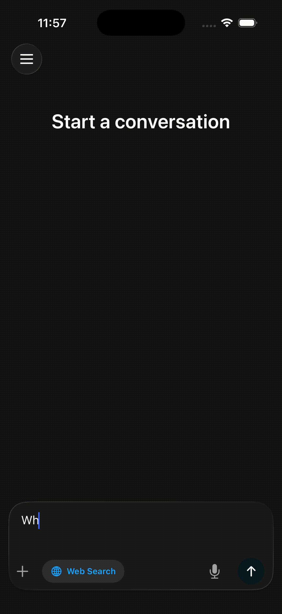
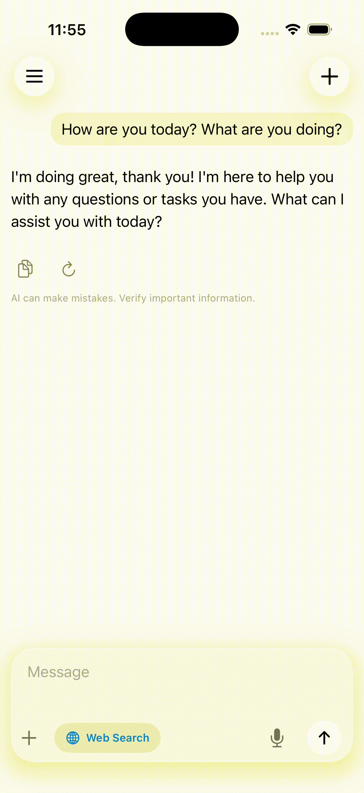

<p><h1>SwiftChat</h1></p>
<p><h4>A production-ready iOS chat template powered by the OpenAI Responses API, built with SwiftUI</h4></p>


<p>
&nbsp;
&nbsp;
&nbsp;

</p>

## Overview

SwiftChat is a fully functional AI chat app template for iOS. It connects to any OpenAI-compatible API and supports streaming responses, reasoning/thinking models, web search, image attachments, voice input, and LaTeX rendering out of the box.

Use it as a starting point for your own AI-powered chat app, or as a reference for how to integrate the OpenAI Responses API into a SwiftUI project.

## Features

- **Streaming responses** via the OpenAI Responses API with real-time token display
- **Reasoning model support** with collapsible thinking boxes (o3, o4-mini, etc.)
- **Web search** with live search status indicators and source citations
- **Image attachments** with camera, photo library, and multimodal model support
- **Document attachments** (PDF, TXT, MD, CSV, HTML) injected as context
- **Voice input** with audio recording and Whisper transcription
- **LaTeX and Markdown rendering** with syntax-highlighted code blocks
- **Chat history** with sidebar navigation and swipe gestures
- **Auto-generated titles** for conversations using a lightweight model
- **Dark mode and Light mode** with adaptive theming
- **iPad support** with side-by-side sidebar layout
- **Liquid Glass icon** for iOS 26+ with legacy icon fallback

## Getting Started

### Prerequisites

- Xcode 26+
- iOS 18+ deployment target
- An OpenAI API key (or any OpenAI-compatible API)

### Setup

1. **Clone the repository**
   ```bash
   git clone https://github.com/user/SwiftChat.git
   cd SwiftChat
   ```

2. **Open in Xcode**
   ```bash
   open SwiftChat.xcodeproj
   ```

3. **Run the app** on a simulator or device. On first launch, you'll be prompted to enter your API key.

### Configuration

All configuration lives in `AppConfig.swift`:

```swift
class AppConfig: ObservableObject {
    var apiKey: String = "YOUR_API_KEY"

    /// OpenAI-compatible API host
    var apiHost: String = "api.openai.com"

    /// Base path for the API
    var apiBasePath: String = "/v1"

    /// System prompt sent with every conversation
    var systemPrompt: String = "You are a helpful AI assistant."

    /// Additional rules appended to the system prompt
    var rules: String = ""
}
```

To use a different OpenAI-compatible API (e.g. Azure, a local model, or a proxy), change `apiHost` and `apiBasePath`.

### Models

Default models are configured in `AppConfig.setupDefaultModels()`:

```swift
availableModels = [
    ModelType(id: "gpt-4.1", displayName: "GPT-4.1", ...),
    ModelType(id: "gpt-4.1-mini", displayName: "GPT-4.1 Mini", ...),
    ModelType(id: "o4-mini", displayName: "o4-mini", ...),
]
```

Add or remove models by editing this array. Set `isMultimodal: true` for models that accept image input.

## Architecture

```
SwiftChat/
├── Config/
│   ├── AppConfig.swift          # API configuration, model definitions
│   ├── Constants.swift          # App-wide constants
│   ├── SettingsManager.swift    # User preferences (persisted)
│   └── Theme.swift              # Design system tokens
├── Models/
│   ├── ChatModels.swift         # Chat, Message, WebSearchState
│   └── AttachmentModels.swift   # Attachment types (image, document)
├── ViewModels/
│   └── ChatViewModel.swift      # Core logic: streaming, chat management
├── Views/
│   ├── ChatView.swift           # Main container with sidebar
│   ├── ChatListView.swift       # Message list (UITableView-backed)
│   ├── MessageView.swift        # Individual message bubbles
│   ├── MessageInputView.swift   # Input bar with attachments, mic, send
│   ├── ChatSidebar.swift        # Chat history sidebar
│   ├── LaTeXMarkdownView.swift  # Rich text rendering
│   └── ...                      # Supporting views
├── Services/
│   ├── AudioRecordingService.swift      # Voice recording + transcription
│   ├── StreamingMarkdownChunker.swift   # Incremental markdown parsing
│   ├── ThinkingSummaryService.swift     # Thinking content summarizer
│   └── ThinkingTextChunker.swift        # Thinking text paragraph splitter
├── Utilities/
│   ├── ChatQueryBuilder.swift   # Builds Responses API queries
│   └── NetworkMonitor.swift     # Connectivity monitoring
└── Extensions/
    ├── Color.swift              # App color palette
    └── Color+Hex.swift          # Hex color initializer
```

### Key Components

**`ChatQueryBuilder`** converts your chat history into a `CreateModelResponseQuery` for the Responses API, handling system prompts, multimodal content, document context, and web search tools.

**`ChatViewModel`** manages the streaming loop, processing `ResponseStreamEvent` variants:
- `.outputText(.delta)` for response content
- `.reasoning(.delta)` for thinking/reasoning content
- `.webSearchCall(...)` for search status updates
- `.outputTextAnnotation(.added)` for citations

**`StreamingMarkdownChunker`** breaks streaming content into semantic chunks (paragraphs, code blocks, tables, etc.) so only the active chunk re-renders during streaming.

## Customization

### System Prompt
Edit `AppConfig.systemPrompt` to change the AI's behavior. You can use placeholders:
- `{MODEL_NAME}` - replaced with the current model's display name
- `{LANGUAGE}` - replaced with the user's selected language
- `{CURRENT_DATETIME}` - replaced with the current date/time
- `{TIMEZONE}` - replaced with the user's timezone

### Theming
Colors are defined in `Extensions/Color.swift`. The `Theme.swift` file provides semantic design tokens. Both light and dark mode are fully supported.

### Adding New Models
Add entries to `AppConfig.setupDefaultModels()`:
```swift
ModelType(
    id: "your-model-id",        // API model identifier
    displayName: "Display Name", // Shown in model picker
    fullName: "Full Model Name", // Used in system prompt
    iconName: "openai-icon",    // Asset catalog image name
    isMultimodal: true           // Set true if model accepts images
)
```

## Dependencies

| Package | Purpose |
|---------|---------|
| [OpenAI](https://github.com/tinfoilsh/openai-swift-fork) | OpenAI API client with Responses API + streaming support |
| [Textual](https://github.com/tinfoilsh/textual) | Markdown/rich text rendering for SwiftUI |
| [SwiftMath](https://github.com/mgriebling/SwiftMath) | Native LaTeX math rendering |

All dependencies are managed via Swift Package Manager and resolve automatically when you open the project.

## Requirements

- iOS 18.0+
- Xcode 16+
- Swift 5.0+

## License

This project is available under the MIT License. See the [LICENSE](LICENSE) file for details.
